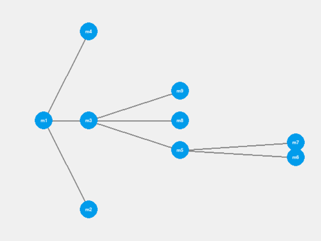

# interactive_subgraph_visualiser
This project is an interactive subgraph visualiser.

## How to run

1. Clone the repository
2. Using a package manager, install the required packages from prod-env.yml
2. Run the following command in the terminal
```
python3 src/main.py
```

## Features

You can load in a file with a graph in it and then select a node to see the subgraph of that node.
You can setup the depth, horizontal and vertical scatters as well.


